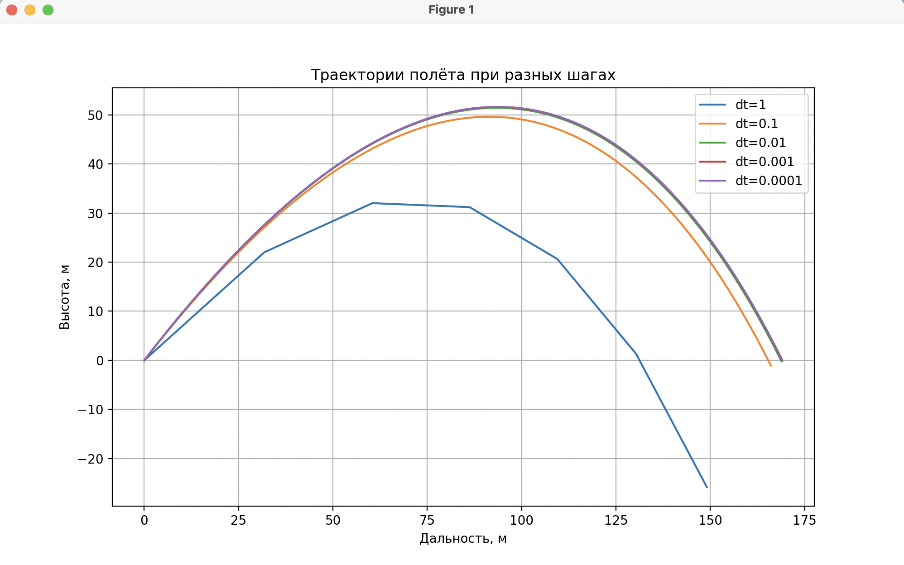
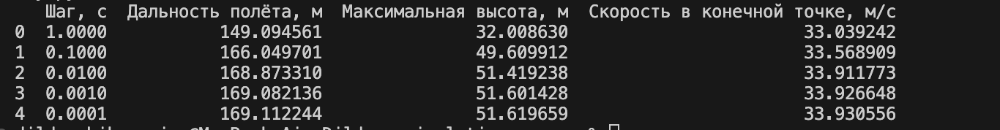

# Отчёт по лабораторной работе
## Моделирование полёта тела в атмосфере

### Результаты моделирования

**Таблица 1 – Результаты расчётов при различных шагах интегрирования**

### Вывод

Начиная с шага времени 0.01 результаты изменяются слабо, их можно считать достаточными для практических расчётов. Для данной модели можно принять Δt = 0.01–0.001 с оптимальным.